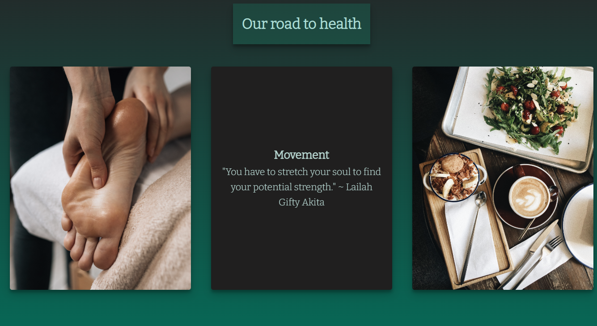

# Human Health

## Introduction
Human health is manual therapy and yoga service for everyone. Located in Bilbao, it provides the highest standard in healing through non-chemical ways of treatment. The pactioner focuses on using his hand, nutrition and movement to improve health in the patients. The aim of this project is to give visibility to this practioner, showing the methods and techniques he uses in his clinic.
## Table of Contents 

# Table of Contents
 [1. User Expereince (UX) design](#ux)
  - [User Goals:](#user-goals)
  - [User Expectations:](#user-expectations)
  -	[Colour scheme and font](#color-scheme)
  - [Site skeleton (wireframes)-3 pages](#wireframes)
    - [Introduction page](#introduction-page)
    - [Theory page](#theory-page)
    - [Feedback page](#feedback-page)

      
  [2. Features](#features)

  [3.Technologies used](#technologies-used)

  [4.Testing](#testing)

  [5.Bugs](#bugs)

  [6. Deployment](#deployment)

  [7. Acknowledgement](#acknowledgement)

  
# 1. User Experience (UX) design
  [Go to the top](#table-of-contents)

## 1.1. User targets
The following users types can be benifitted from the website:

* Individuals suffering from pain, either chronic or accute.
* Individuals wanting to improve their fitness levels.
* Individuals wanting to inmerge themselves in a new self-care practice.

## 1.2. Colour scheme and font
A color scheme that consisisted of different tones of blue and grey was used. this give a relaxing experience to the user. The differnet colors used where:

* #b1dfd7: Primarily for the text colour
* #076856, #252526: Used a linear gradient in the background
* rgba(19, 163, 132, 0.2): Used a  background for the headings
* #649B92: Used to create the form section and the schedule section

## 1.3. Color scheme
We used the following technologies to choose this color scheme:
* [Color palettes](https://mycolor.space/?hex=%23F6CA80&sub=1): Use to find colors that would match
* [Eye dropper](https://eyedropper.org/): USed to pick color from other sources.
* [WebAIM](https://webaim.org/resources/contrastchecker/): To check accesability, as shown below.

## 1.4. Site skeleton
The [Balsamiq](https://balsamiq.com/) application was used to create wireframes. This gave the template of the UI. The concept design of the main page can be seen below:

# 2. Features

 ## All 3 pages:

 ### Header:
- A navigation bar is placed at the top right corner of the page. A hover effect is used that changes the  background colour of the elements (blue box). The page that is actually being used is underlined
- The logo is placed on the top left corner 

Header screenshot:
  

### Footer:
- Social media links (for facebook, Linkden and Twitter) are placed at the bottom of the page. All the links will open in a new tab. 
- A "Book now" button that takes you directly to the the booking (booking.html) page.

Footer screenshot:
  

## Landing page:
- The landing page includes a picture and a text that both indicate that the site is refering to a manual therapy and yoga service in a Bilbao. The background color of the image was choosen in accordance to the color scheme.

Landing page screenshot:
  

## Text description:
- A couple of text paragrhaph that explain what the studio fills like and the goals of the practitioners towards his patients

Landing page screenshot:
  

## Our road to health section:
- A section that displays 3 images that indicate the philosophy of the practioner, focusiong on manual therapy, movement and nutrition
-These 3 images have an hoover effect, making the image disapear giving place to a title of each pilar of the therapy with a quote.

Road to health before hover page screenshot:
  

After hoover screenshot:
  

## Practioner section
-An image of the practioner with a brief description of his qualification

Practioner screenshot:
  

## Techniques section
- A section that separeted into left and right. The left side contains the differnet techniques a patient should expect to expirience during his time at the clinic.
- An image on the right of a woman doing a yoga pose.

Technique page screenshot:
  

## Schedule section
- A schedule that shows what times the different services are available. 

Schedule page screenshot:
  

## Contact us section
- This section includes the form which the user will use to get in contact with the practioner to either book a individual therapy session or to attend the different clases.
-The user will be asked to submit their full name and email address.

Form page screenshot:
  

## Map section
-A google map of the location of the clinic (mock). The map opens up on a different tab if pressed "view larger map"

Map page screenshot:
  

## Features that could be implemented
- A more detailed section with a more specific qualification background and a couple of images/videos of the practioner doing yoga or treating someone.

# 4. Testing
  
## 4.1 Testing using tools

### Google Developer Tools:
Google developer tools (Chrome DevTools) was used as debugging tool. The code was inspected modified here, before changing the source code.

### Responsive Tools:
[Am I Responsive](http://ami.responsivedesign.is/) site was used to check the responsiveness of the web page

### W3C Validator Tools:
[W3C Markup](https://validator.w3.org/#validate_by_input+with_options) was used to check for any errors within the HTML pages.

Talk about errors found

[W3C CSS Validation](https://jigsaw.w3.org/css-validator/) was used to check for any error within the CSS stylesheet. 

Talk about errors and screenshots

