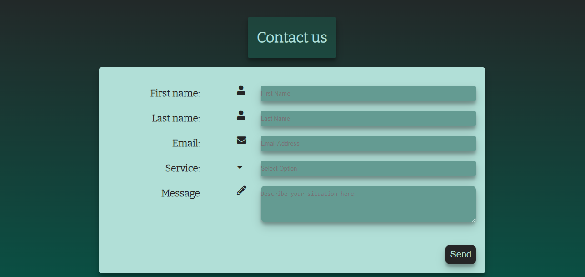
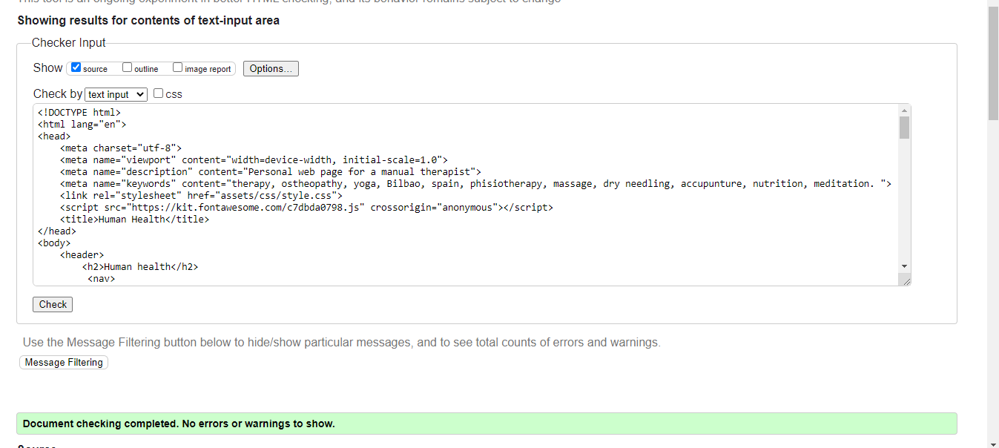
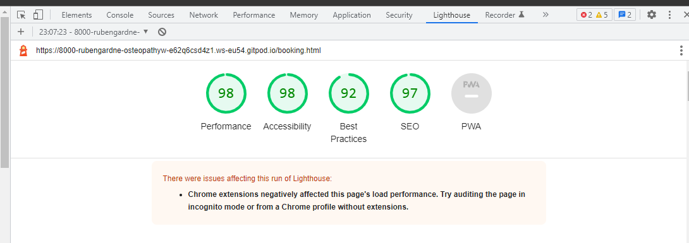

# Human Health

## Introduction
Human health is manual therapy and yoga service for everyone. Located in Bilbao, it provides the highest standard in healing through mechanical ways of treatment. The pactioner focuses on using his hand, nutrition and movement to improve health in the patients. The aim of this project is to give visibility to this practioner, showing the methods and techniques he uses in his clinic.

A live website can be found [here](https://rubengardner.github.io/osteopathyweb/index.html).
  

## Table of Contents 

# Table of Contents
  ## 1. User Expereince
      
  ## 2. Features

  ## 3.Technologies used

  ## 4.Testing 

  ## 5. Bugs]#bugs

  ## 6. Deployment

  ## 7. Acknowledgement

# 1. User Experience (UX) design

## 1.1. User targets
The following users types can be benifitted from the website:

* Individuals suffering from pain, either chronic or accute.
* Individuals wanting to improve their fitness levels.
* Individuals wanting to inmerge themselves in a new self-care practice.

## 1.2. Colour scheme and font
A color scheme that consisisted of different tones of blue and grey was used. this give a relaxing experience to the user. The differnet colors used where:

* #b1dfd7: Primarily for the text colour
* #075547, #252526: Used a linear gradient in the background
* rgba(19, 163, 132, 0.2): Used a  background for the headings
* #649B92: Used to create the form section and the schedule section

## 1.3. Color scheme
We used the following technologies to choose this color scheme:
* [Color palettes](https://mycolor.space/?hex=%23F6CA80&sub=1): Use to find colors that would match
* [Eye dropper](https://eyedropper.org/): USed to pick color from other sources.
* [WebAIM](https://webaim.org/resources/contrastchecker/): To check accesability, as shown below.

## 1.4. Site skeleton
The [Balsamiq](https://balsamiq.com/) application was used to create wireframes. This gave the template of the UI. The concept design of the main page can be seen below:

# 2. Features

 ## All 3 pages:

 ### Header:
- A navigation bar is placed at the top right corner of the page. A hover effect is used that changes the  background colour of the elements (blue box). The page that is actually being used is underlined
- The logo is placed on the top left corner 

Header screenshot:
  

### Footer:
- Social media links (for facebook, Linkden and Twitter) are placed at the bottom of the page. All the links will open in a new tab. 
- A "Book now" button that takes you directly to the the booking (booking.html) page.

Footer screenshot:
  

## Landing page:
- The landing page includes a picture and a text that both indicate that the site is refering to a manual therapy and yoga service in a Bilbao. The background color of the image was choosen in accordance to the color scheme.

Landing page screenshot:
  

## Text description:
- A couple of text paragrhaph that explain what the studio fills like and the goals of the practitioners towards his patients

Landing page screenshot:
  

## Our road to health section:
- A section that displays 3 images that indicate the philosophy of the practioner, focusiong on manual therapy, movement and nutrition
-These 3 images have an hover effect, making the image disapear giving place to a title of each pilar of the therapy with a quote.

Road to health before hover page screenshot:
  

After hover screenshot:
  

## Practioner section
-An image of the practioner with a brief description of his qualification

Practioner screenshot:
  

## Techniques section
- A section that separeted into left and right. The left side contains the differnet techniques a patient should expect to expirience during his time at the clinic.
- An image on the right of a woman doing a yoga pose.

Technique page screenshot:
  

## Schedule section
- A schedule that shows what times the different services are available. 

Schedule page screenshot:
  

## Contact us section
- This section includes the form which the user will use to get in contact with the practioner to either book a individual therapy session or to attend the different clases.
-The user will be asked to submit their full name and email address.

Form page screenshot:
  

## Map section
-A google map of the location of the clinic (mock). The map opens up on a different tab if pressed "view larger map"

Map page screenshot:
  

## Features that could be implemented
- A more detailed section with a more specific qualification background and a couple of images/videos of the practioner doing yoga or treating someone.

# 3. Technologies used

* [HTML5](https://en.wikipedia.org/wiki/HTML5) (markup language) was used for structuring and presenting content of the website.
* [CSS3](https://en.wikipedia.org/wiki/CSS) (Cascading Style Sheets) was used to provide the style to the content written in a HTML.
* [Balsamiq](https://balsamiq.com/) was used to create wireframes of the website (desktop and mobile version).
* [Google Fonts](https://fonts.google.com/) was used to import font-family "Lato" and "Oswald" into style,css file and which was used throughout the pages of the website.
* [Font Awesome](https://fontawesome.com/) was used to improt icons to the sites.
* [Chrome](https://www.google.com/intl/en_uk/chrome/) was used to debug and test the source code.
* [Gitpod](https://www.gitpod.io/) was used as the Code Editor for the site
* [Github](https://github.com/) was used to create the repository.
* [W3C Markup](https://validator.w3.org/) and [Jigsaw validation](https://jigsaw.w3.org/) tools were used to validate the HTML code and CSS code.
* [Ami](http://ami.responsivedesign.is/#) was used to develop a Mockup screenshot generator
  
# 4. Testing
  
## 4.1 Testing using tools

### Google Developer Tools:
Google developer tools (Chrome DevTools) was used as debugging tool. The code was inspected modified here, before changing the source code.

### Responsive Tools:
[Am I Responsive](http://ami.responsivedesign.is/) site was used to check the responsiveness of the web page

### W3C Validator Tools:
[W3C Markup](https://validator.w3.org/#validate_by_input+with_options) was used to check for any errors within the HTML pages.No errors were found in all 3 pages.

Index page html validation screenshot:
  

Services page html validation screenshot:
  

Booking page html validation screenshot:
  

[W3C CSS Validation](https://jigsaw.w3.org/css-validator/) was used to check for any error within the CSS stylesheet. No errors were found.

Css style sheet validation screenshot:
  

## 4.2. Manual testing

I have tested my site on multiple devices. These include:
  - Galaxy S5 (360 x 640)
  - iPad Pro (1024 x 1366)

All the media queries where used during the testing of these two devices, being this the reason for choosing them.

## All 3 pages:
### Navigation bars

TEST            | OUTCOME                          | PASS / FAIL  
--------------- | -------------------------------- | ---------------
Introduction page | on click "home", the browser redirects me to the introduction page. The hoever effect (blue box) appears when mouse is on "home".| PASS
Services page | on click "services", the browser redirects me to the services page page. The hoever effect (blue box) appears when mouse is on "services". | PASS
Booking page|  on click "booking", the browser redirects me to the booking page. The hoever effect (blue box) appears when mouse is on "booking". | PASS
Responsive | All pages and elements were responsive (mobile and website) using differnt breakpoints.| PASS
Foreground & background  color| Checked foreground information is not distracted by backgrounds| PASS
Text|Checked if all fonts and colors used are consistent or not|PASS

### Footer
TEST            | OUTCOME                          | PASS / FAIL  
--------------- | -------------------------------- | ---------------
Facebook | on clicking Facebook icon, a new tab opens and redirects to the Facebook website.| PASS
Twitter | on clicking Linkedin icon, a new tab opens and redirects to the Twitter website.  | PASS
Instagram | on clicking instagram icon, a new tab opens and redirects to the instagram website.  | PASS
Book now | on clicking book now button, it redirects you to the booking page on the same tab.  | PASS

### Home page
TEST            | OUTCOME                          | PASS / FAIL  
--------------- | -------------------------------- | ---------------
Media| All images and videos on the pages load and played. The video added was not auto play. All images were checked if it blurred in differnt screen sizes| PASS
Responsive | Responsive of the page in differnce screen sizes (mobile and website) using differnt breakpoints were checked.| PASS
Accessibility | Checked the accessibility of the page using lighthouse| PASS

### Service page
TEST            | OUTCOME                          | PASS / FAIL  
--------------- | -------------------------------- | ---------------
Media| All images on the pages load. All images were checked if it blurred in differnt screen sizes| PASS
Responsive | Responsive of the page in differnce screen sizes (mobile and website) using differnt breakpoints were checked.| PASS
Accessibility | Checked the accessibility of the page using lighthouse| PASS

### Booking page
TEST            | OUTCOME                          | PASS / FAIL  
--------------- | -------------------------------- | ---------------
Responsive | Responsive of the page in differnce screen sizes (mobile and website) using differnt breakpoints were checked.| PASS
Submit| Checked if submit button works|PASS
Dropdown options| Checked if drop down options works|PASS
Google map| Checked if google map when clicked on view larger map redirect to the google map page in new tab works ot not|PASS
Accessibility | Checked the accessibility of the page using lighthouse| PASS

# 5 Bugs

No bugs where encountered during the creation of this project

# 6. Deployment

The site was deployed to GitHub pages using the following steps:
- Sign up to GutHub
- Create a new repository on GitHub.
- Click on settings on the navigation bar under the repository title.
- Select pages on the left menu bar.
- Click on the master branch and save.
- This will now generate a link with your website live.
- The live link can be found here - (https://rubengardner.github.io/osteopathyweb/)

  # Credits

## Code
* The fonts used in this website came from [Google fonts](https://fonts.google.com/about)
* The footer code came from the Love Running projects
* The icons in the footer and booking page came from [Font Awesome](https://fontawesome.com/)
* The responsive code for the google maps came from [Blog Buda](https://blog.duda.co/responsive-google-maps-for-your-website)

## Content 
* The image in the landing page was taken from [Unsplash](https://images.unsplash.com/photo-1515377905703-c4788e51af15?ixlib=rb-1.2.1&ixid=MnwxMjA3fDB8MHxzZWFyY2h8OHx8bWFzc2FnZXxlbnwwfHwwfHw%3D&auto=format&fit=crop&w=500&q=60-->)
* The rest of the images were taken from [Pexels](https://www.pexels.com/)
* The testing content was taken from [dhakal79 project 1 portofolio](https://github.com/dhakal79/Portfolio-project-MS1/blob/master/README.md).

